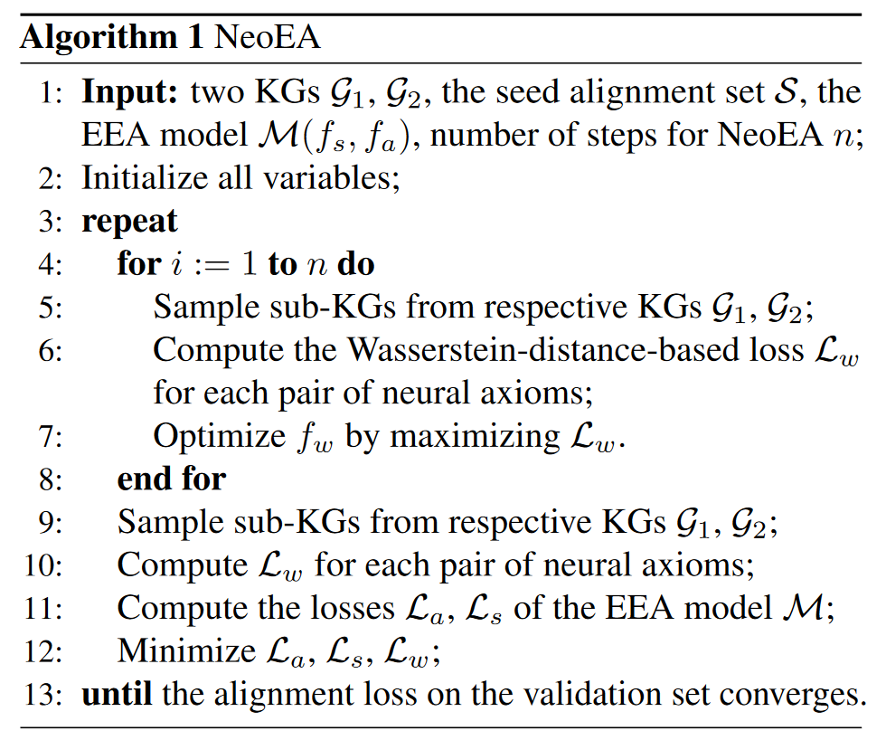
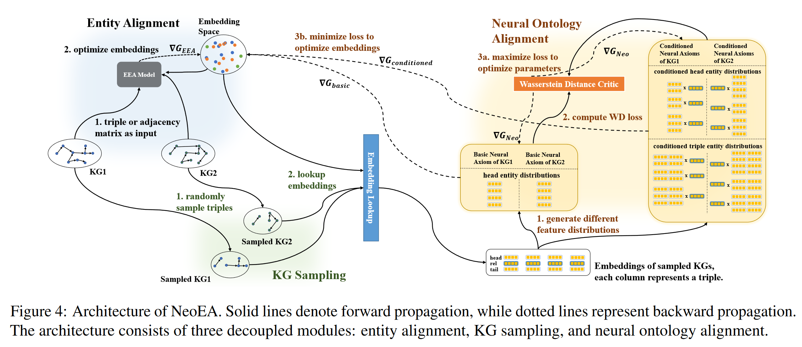
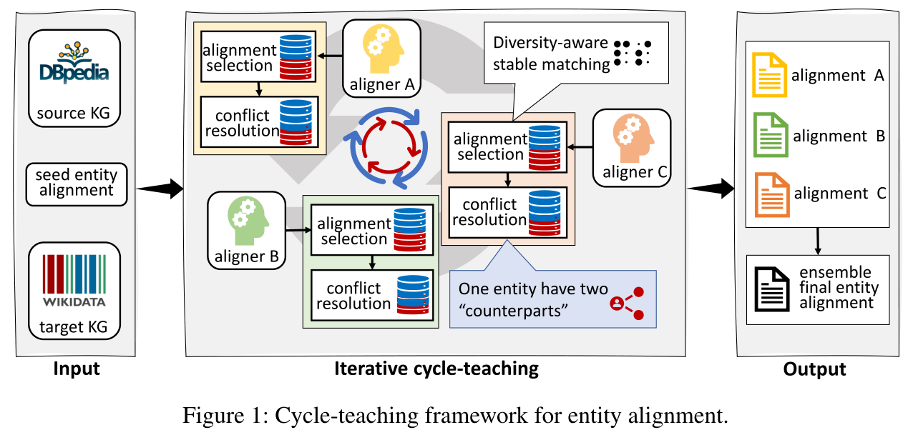
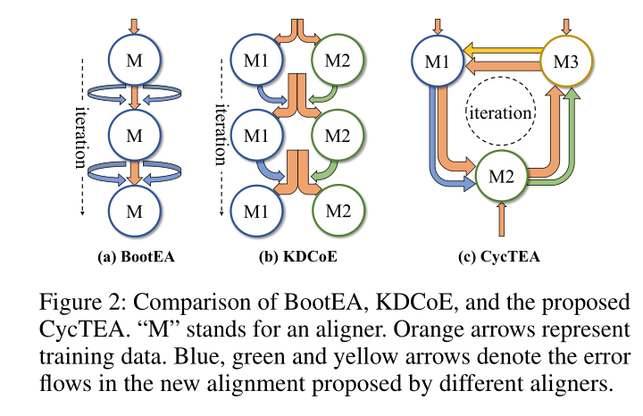
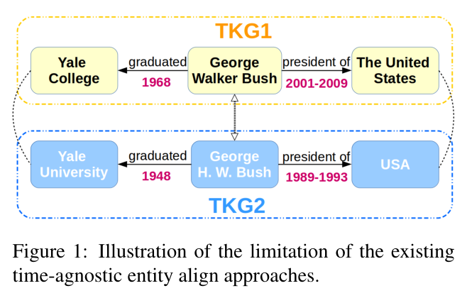
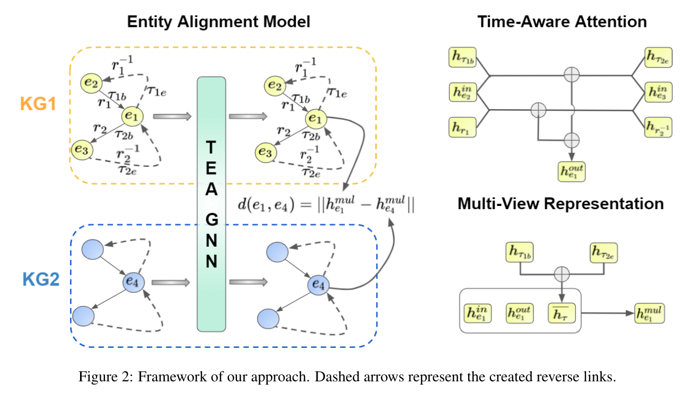
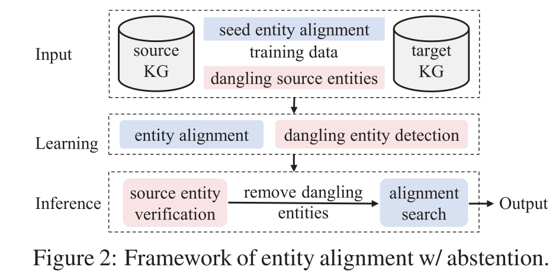

# KGEA
## [2022 ICML] Understanding and Improving Knowledge Graph Embedding for Entity Alignment
20220911  
> https://github.com/guolingbing/NeoEA

大多数现有的研究都是基于这样的假设：少数实体对齐种子可以作为连接两个KG的嵌入空间的锚点(anchor)。  
然而，没有人研究(investigate)过这种假设的合理性。  
为此，作者定义了一个从现有EEA方法中抽象出来的典型范式，并分析了两个可能对齐的实体之间的嵌入差异是如何被评分函数中预定的边际所隐含约束的。发现：  
- 这些约束不能充分确保对齐学习的准确性(提出NeoEA方法缓解)
-> 不仅追求对齐实体对在几何空间中接近；通过消除**嵌入分布**和**基础本体知识**的差异来对齐两个KG的**神经本体**  

神经本体：那些赋予某些实体嵌入分布规律的三元组  
神经本体对齐：两个KG之间的多个神经公理(axioms)对齐的过程  

  

## [2022 AAAI] Ensemble Semi-supervised Entity Alignment via Cycle-Teaching  
20220912  
> https://github.com/JadeXIN/CycTEA

传统的半监督学习方法，学习出的对齐实体对存在误差。  
-> 设计了一个迭代循环教学框架，用于半监督实体对齐  
核心思想：同时训练多个实体对齐模型（对齐器），迭代学习，使得后继能发现更多对齐  
- 提出了一个多样性感知的对齐选择方法  
- 设计了一种冲突解决机制：对齐器输出的对齐与其老师对齐的冲突  
- 设计了一种周期教学顺序的最优选择策略，使多个对齐器的整体性能最大化  

循环教学 -> 打破单个模型学习能力的限制，减低噪声  

## [2021 EMNLP] Time-aware Graph Neural Networks for Entity Alignment between Temporal Knowledge Graphs
2022/9/13

>  https://github.com/soledad921/TEA-GNN 
基于图神经网络提出了一种时间感知的实体对齐模型TEA-GNN  
将不同图谱的实体、关系、时间戳嵌入到同一向量空间  
- 时间感知的机制：将不同的权重分配给不同的节点，并通过邻居的相关关系和时间戳的嵌入，计算出正交变换矩阵。
 

使用正交矩阵建模关系嵌入和时间嵌入  
权重学习利用了GAT  

## [2021 ACL] Knowing the No-match: Entity Alignment with Dangling Cases

图谱中存在找不到对齐的实体：dangling entities  
设计了一个多任务学习框架用于实体对齐和自由(悬空)实体检测（基于最近邻分布）  

- 最近邻分类
- 边缘排序
- 背景排序

检测并过滤悬空实体，能提供更健壮的对齐  

1）最近邻分类  
使用前馈网络(FFN)分类器对实体进行二分类
$p(y=1 | x) = \mathrm{sigmoid} \left(FFN(\mathbf{M}x - x_\mathrm{nn} ) \right)$

$\mathcal{D}$：悬空实体集合  
$\mathcal{A}$：可匹配实体集合  
对于所有$x \in \mathcal{D} \cup \mathcal{A}$
$$
\begin{aligned}
\mathcal{L}_{x}=-&\left(y_{x} \log (p(y=1 \mid x))\right.\\
&\left.+\left(1-y_{x}\right) \log (1-p(y=1 \mid x))\right)
\end{aligned}
$$

2）边缘排序  
让悬空实体在嵌入空间中具有单独的表示
> 在悬空实体和它们采样的nn之间设置一个距离边界
$$
\mathcal{L}_{x}=\max \left(0, \lambda-\left\|\mathbf{M} \mathbf{x}-\mathbf{x}_{\mathrm{nn}}\right\|\right)
$$

3）背景排序  
边缘距离的选择是个困难的问题。
> lets a classifier equally penalize the output logits for samples of classes that are unknown to training (i.e. background classes)

将所有悬空实体视为嵌入空间的“背景”，它们应该远离可匹配的对象  
减少了悬空实体嵌入的规模，以进一步在可匹配实体和悬空实体的嵌入之间提供分离。对于每个悬空实体$x$，$X_{x}^{v}$为大小为$v$的随机抽样目标实体的集合
$$
\mathcal{L}_{x}=\sum_{x^{\prime} \in X_{x}^{v}}\left|\lambda_{x}-\left\|\mathbf{M} \mathbf{x}-\mathbf{x}^{\prime}\right\|\right|+\alpha\|\mathbf{x}\|
$$
使得相对较近的实体远离源实体，不需要预定义的边缘距离。  
$\lambda_{x}=\frac{1}{v} \sum_{x^{\prime} \in X_{x}^{v}}\left\|\mathbf{M} \mathbf{x}-\mathbf{x}^{\prime}\right\|$