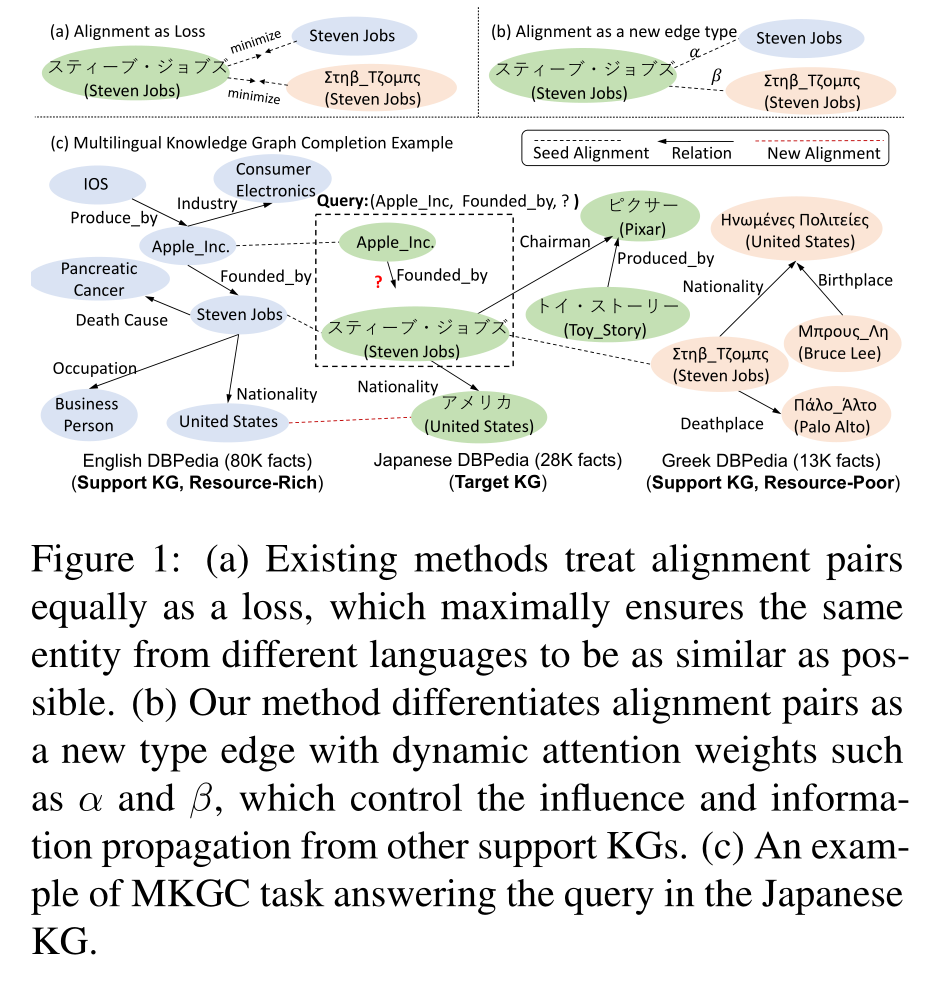
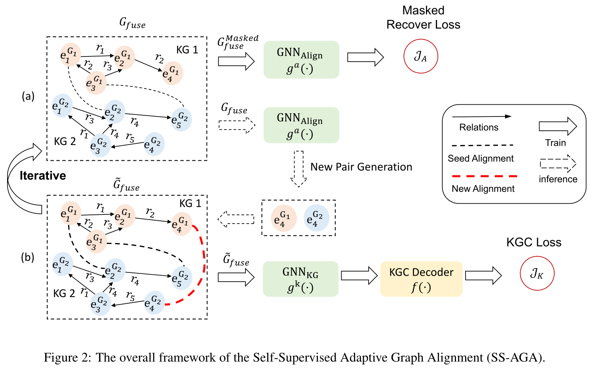
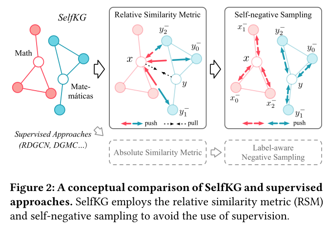

# KGEA
## [2022 ICML] Understanding and Improving Knowledge Graph Embedding for Entity Alignment
20220911  
> https://github.com/guolingbing/NeoEA

大多数现有的研究都是基于这样的假设：少数实体对齐种子可以作为连接两个KG的嵌入空间的锚点(anchor)。  
然而，没有人研究(investigate)过这种假设的合理性。  
为此，作者定义了一个从现有EEA方法中抽象出来的典型范式，并分析了两个可能对齐的实体之间的嵌入差异是如何被评分函数中预定的边际所隐含约束的。发现：  
- 这些约束不能充分确保对齐学习的准确性(提出NeoEA方法缓解)
-> 不仅追求对齐实体对在几何空间中接近；通过消除**嵌入分布**和**基础本体知识**的差异来对齐两个KG的**神经本体**  

神经本体：那些赋予某些实体嵌入分布规律的三元组  
神经本体对齐：两个KG之间的多个神经公理(axioms)对齐的过程  

	
    

## [2022 AAAI] Ensemble Semi-supervised Entity Alignment via Cycle-Teaching  
20220912  
> https://github.com/JadeXIN/CycTEA

传统的半监督学习方法，学习出的对齐实体对存在误差。  
-> 设计了一个迭代循环教学框架，用于半监督实体对齐  
核心思想：同时训练多个实体对齐模型（对齐器），迭代学习，使得后继能发现更多对齐  
- 提出了一个多样性感知的对齐选择方法  
- 设计了一种冲突解决机制：对齐器输出的对齐与其老师对齐的冲突  
- 设计了一种周期教学顺序的最优选择策略，使多个对齐器的整体性能最大化  

循环教学 -> 打破单个模型学习能力的限制，减低噪声  

	
    

## [2021 EMNLP] Time-aware Graph Neural Networks for Entity Alignment between Temporal Knowledge Graphs
2022/9/13

>  https://github.com/soledad921/TEA-GNN 
基于图神经网络提出了一种时间感知的实体对齐模型TEA-GNN  
将不同图谱的实体、关系、时间戳嵌入到同一向量空间  
- 时间感知的机制：将不同的权重分配给不同的节点，并通过邻居的相关关系和时间戳的嵌入，计算出正交变换矩阵。
 

	
    

使用正交矩阵建模关系嵌入和时间嵌入  
权重学习利用了GAT  

## [2021 ACL] Knowing the No-match: Entity Alignment with Dangling Cases

图谱中存在找不到对齐的实体：dangling entities  
设计了一个多任务学习框架用于实体对齐和自由(悬空)实体检测（基于最近邻分布）  

- 最近邻分类
- 边缘排序
- 背景排序

检测并过滤悬空实体，能提供更健壮的对齐  

	

1）最近邻分类  
使用前馈网络(FFN)分类器对实体进行二分类
$p(y=1 | x) = \mathrm{sigmoid} \left(FFN(\mathbf{M}x - x_\mathrm{nn} ) \right)$

$\mathcal{D}$：悬空实体集合  
$\mathcal{A}$：可匹配实体集合  
对于所有$x \in \mathcal{D} \cup \mathcal{A}$
$$
\begin{aligned}
\mathcal{L}_{x}=-&\left(y_{x} \log (p(y=1 \mid x))\right.\\
&\left.+\left(1-y_{x}\right) \log (1-p(y=1 \mid x))\right)
\end{aligned}
$$

2）边缘排序  
让悬空实体在嵌入空间中具有单独的表示
> 在悬空实体和它们采样的nn之间设置一个距离边界
$$
\mathcal{L}_{x}=\max \left(0, \lambda-\left\|\mathbf{M} \mathbf{x}-\mathbf{x}_{\mathrm{nn}}\right\|\right)
$$

3）背景排序  
边缘距离的选择是个困难的问题。
> lets a classifier equally penalize the output logits for samples of classes that are unknown to training (i.e. background classes)

将所有悬空实体视为嵌入空间的“背景”，它们应该远离可匹配的对象  
减少了悬空实体嵌入的规模，以进一步在可匹配实体和悬空实体的嵌入之间提供分离。对于每个悬空实体$x$，$X_{x}^{v}$为大小为$v$的随机抽样目标实体的集合
$$
\mathcal{L}_{x}=\sum_{x^{\prime} \in X_{x}^{v}}\left|\lambda_{x}-\left\|\mathbf{M} \mathbf{x}-\mathbf{x}^{\prime}\right\|\right|+\alpha\|\mathbf{x}\|
$$
使得相对较近的实体远离源实体，不需要预定义的边缘距离。  
$\lambda_{x}=\frac{1}{v} \sum_{x^{\prime} \in X_{x}^{v}}\left\|\mathbf{M} \mathbf{x}-\mathbf{x}^{\prime}\right\|$

## [IJCAI 2022] Entity Alignment with Reliable Path Reasoning and Relation-Aware Heterogeneous Graph Transformer

知识图谱中存在大量的多步关系路径

## *[ACL 2022]Multilingual Knowledge Graph Completion with Self-Supervised Adaptive Graph Alignment

https://github.com/amzn/ss-aga-kgc

问题：  
（1）对齐对在训练中被平等的处理，忽略了图谱中实体量的不一致性  
（2）种子对齐时稀缺的。新的对齐对的识别通常以一种有噪声的无监督方式来进行。

提出了一种新的自监督自适应图对齐(SS-AGA)方法  
- 将对齐作为一种新的边缘类型，将所有kg融合为一个整体图 -> 跨KGs信息传播和噪声影响可以通过关系感知的注意权重自适应控制
- SS-AGA具有一个新的匹配对生成器，动态捕获自监督范式中的潜在对齐对

	
    

Mask一部分对齐种子，用于训练对齐对生成模块$g^a(\cdot)$，

- 基于注意的关系感知GNN来学习实体的上下文化MKG嵌入

$$
\mathcal{J}_{K}=\sum_{(e_{h}, r, e_{t}) \in \mathcal{T}_{m}, (e_{h}', r, e_{t}') \notin \mathcal{T}_{m}, m=1,...,M}\left[f\left(\boldsymbol{e}_{h}{ }^{\prime}, \boldsymbol{r}, \boldsymbol{e}_{t}^{\prime}\right)-f\left(\boldsymbol{e}_{h}, \boldsymbol{r}, \boldsymbol{e}_{t}\right)+\gamma\right]_{+}
$$

$$
\mathcal{J}_{A}^{G_{i} \leftrightarrow G_{j}}= \sum_{\left(e_{h}, e_{t}\right) \in \Gamma_{i j}^{p}, (e_{h^{\prime}}, e_{t^{\prime}}) \in \Gamma_{i j}^{n} }
\left[\left\|\widetilde{\boldsymbol{e}}_{h}^{a}-\widetilde{\boldsymbol{e}}_{t}^{a}\right\|_{2}-\left\|\widetilde{\boldsymbol{e}}_{h^{\prime}}^{a}-\widetilde{\boldsymbol{e}}_{t^{\prime}}^{a}\right\|_{2}+\gamma_{a}\right]_{+} \\
$$

$$
\mathcal{J}_{A}=\sum_{1 \leq i<j \leq M} \mathcal{J}_{A}^{G_{i} \leftrightarrow G_{j}}
$$

其中$\Gamma_{i j}^{p}=\left\{\left(e_{h} \in \mathcal{E}_{i}, e_{t} \in \mathcal{E}_{j}\right):\left(e_{h}, r_{\text {align }}, e_{t}\right) \in\right. \mathcal{T}_{\text {masked }}\}$，$\Gamma_{i j}^{n} = \{ (e_{h} \in \mathcal{E}_i, e_{t} \in \mathcal{E}_{j} : (e_h, e_t) \notin \Gamma_{G_{i} \leftrightarrow G_{j}} \}$

$$
\mathcal{J}=\mathcal{J}_{K}+\lambda \mathcal{J}_{A}
$$

## [2022 WWW] SelfKG: Self-Supervised Entity Alignment in Knowledge Graphs
2022-10-14
> https://github.com/THUDM/SelfKG

通过将未标记的负对齐对彼此推开而不是将标记的正对齐对拉得更近  
贡献：
- 提出了不依赖标签数据的SelfKG框架：1)相对相似度度量，2)自负采样，3)多重负队列
- 试图将未对齐的负实体对推得更远，从而避免使用正实体对监督
- 对一个KG中的每个实体，直接从同一KG中抽样实体，形成其负对

自监督训练：
- relative similarity metric
- self-negative sampling
- multiple negative queues

### 嵌入表示
1）采用LaBSE多语言预训练语言模型，对109种不同的语言进行训练——将不同的知识图嵌入到一个单一空间中
> Fangxiaoyu Feng, Yinfei Yang, Daniel Cer, Naveen Arivazhagan, and Wei Wang. 2020. Language-agnostic bert sentence embedding.

2）Neighborhood aggregator  
a **single-head** graph attention network with **one layer** to aggregate pre-trained embeddings of **one-hop neighbors**  

	

### relative similarity metric
Noise Contrastive Estimation (NCE):   
$p_x, p_y$: 图的分布  
$p_{pos}$：正实体对的分布表示  
给定一个对齐实体对$(x,y) \sim p_{pos}$，负样本$\left\{y_{i}^{-}\right\}_{i=1}^{M} \stackrel{\text { i.i.d. }}{\sim} p_{y}$  
NCE损失函数为（分母越小越好）： 
$$ 
\begin{aligned}
\mathcal{L}_{\mathrm{NCE}} & \triangleq-\log \frac{e^{f(x)^{\top} f(y) / \tau}}{e^{f(x)^{\top} f(y) / \tau}+\sum_{i} e^{f(x)^{\top} f\left(y_{i}^{-}\right) / \tau}} \\
&=\underbrace{-\frac{1}{\tau} f(x)^{\top} f(y)}_{\text {alignment }}+\underbrace{\log \left(e^{f(x)^{\top} f(y) / \tau}+\sum_{i} e^{f(x)^{\top} f\left(y_{i}^{-}\right) / \tau}\right)}_{\text {uniformity }} .
\end{aligned}
$$

alignment: 将对齐实体对拉进；uniformity：将负样本拉开。  

Relative similarity metric (RSM)
$$
\begin{aligned}
\mathcal{L}_{\mathrm{RSM}} &=-\frac{1}{\tau}+\underset{\left\{y_{i}^{-}\right\}_{i=1}^{M}{ }^{\mathrm{i} . i . \mathrm{d}} . p_{\mathrm{y}}}{\mathrm{E}}\left[\log \left(e^{1 / \tau}+\sum_{i} e^{f(x)^{\top} f\left(y_{i}^{-}\right) / \tau}\right)\right] \\
& \leq \mathcal{L}_{\mathrm{ASM}} \leq \mathcal{L}_{\mathrm{RSM}}+\frac{1}{\tau}\left[1-\min _{(x, y) \sim p_{\mathrm{pos}}}\left(f(x)^{\top} f(y)\right)\right] .
\end{aligned}
$$

### Self-Negative Sampling
- Noisy ASM
$$
\mathcal{L}_{\mathrm{ASM} \mid \lambda, \mathrm{x}}\left(f ; \tau, M, p_{\mathrm{y}}\right)=\underset{\substack{(x, y) \sim p_{\text {pos }} \\\left\{y_{i}^{-}\right\}_{i=1}^{M} \underset{\sim}{\text { i.i.d. }} p_{y}}}{\mathbb{\lambda}}\left[-\log \frac{e^{f(x)^{\top} f(y) / \tau}}{\lambda e^{f(x)^{\top} f(y) / \tau}+\sum_{i} e^{f(x)^{\top} f\left(y_{i}^{-}\right) / \tau}}\right]
$$

- Noisy RSM with self-negative sampling
$$
\lim _{M \rightarrow \infty}\left|\mathcal{L}_{\mathrm{RSM} \mid \lambda, \mathrm{x}}\left(f ; \tau, M, p_{\mathrm{x}}\right)-\mathcal{L}_{\mathrm{RSM} \mid \lambda, \mathrm{x}}\left(f ; \tau, M, p_{\mathrm{y}}\right)\right|=0
$$

$$
\mathcal{L}=\mathcal{L}_{\mathrm{RSM} \mid \lambda, \mathrm{x}}\left(f ; \tau, M, p_{\mathrm{x}}\right)+\mathcal{L}_{\mathrm{RSM} \mid \lambda, \mathrm{y}}\left(f ; \tau, M, p_{\mathrm{y}}\right)
$$