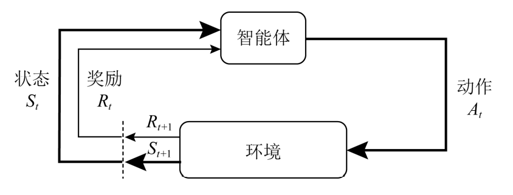

# [2022 计算机研究与发展] 基于强化学习的知识图谱综述

## 1. 知识图谱研究进展
- 知识抽取：NER, RE
- 知识抽取：knowledge graph completion, knowledge graph cleaning
- 知识表示：KGE, KGL
- 知识融合

主要问题：标记数据缺乏，数据常识信息匮乏，知识图谱存在不完整性，基于深度学习的方法缺乏可解释性  

知识图谱与强化学习的结合主要有３种思路：  
1）将知识图谱的相关问题建模成路径(序列)问题,利用强化学习的方法来解决
> 将命名实体识别建模为序列标注任务,使用强化学习方法来学习标注策略;将知识推理建模为路径推理问题,利用强化学习方法进行关系和节点选择。

2）将强化学习方法用于有噪声训练样本的选择或过滤,减少远程监督方法所带来的噪声  
3）将知识图谱所包含的信息作为外部知识,编码进强化学习的状态或奖励中,提升强化学习智能体的探索效率

## 2. 强化学习研究进展
强化学习研究**智能体(agent)**与**环境(environment)**的相互作用  
通过不断学习**最优策略(policy)**,做出序列决策并获得**最大奖励(reward)**  

强化学习的过程可以由**Markov决策过程**(Markovdecision process,MDP)来描述,使用四元组来表示$(A,S,\mathbf{P},R)$  
- $A$：动作空间
- $S$：状态空间
- $\mathbf{P}$：状态转移矩阵
- $R$：奖励
- $\pi$：状态空间到动作空间的映射的策略  

强化学习的**核心目标**是使长期累积奖励最大化：  
累计奖励被定义为奖励序列的一些特定函数,由于未来奖励的总和往往是无穷大的,一种常见的做法是引入折扣因子$\gamma \in [0,1]$用于平衡最近的奖励与未来的奖励，时刻t以后的累积奖励为：
$$
G_t = R_{t+1} + \gamma R_{t+2} + ... = \sum_{\tau=0}^{+ \infty} \gamma^\tau R_{t+\tau+1}
$$

依据是否对环境建模:  
1）基于模型的强化学习方法  
2）无模型的强化学习方法：基于价值、基于策略、基于Actor-Critic  

